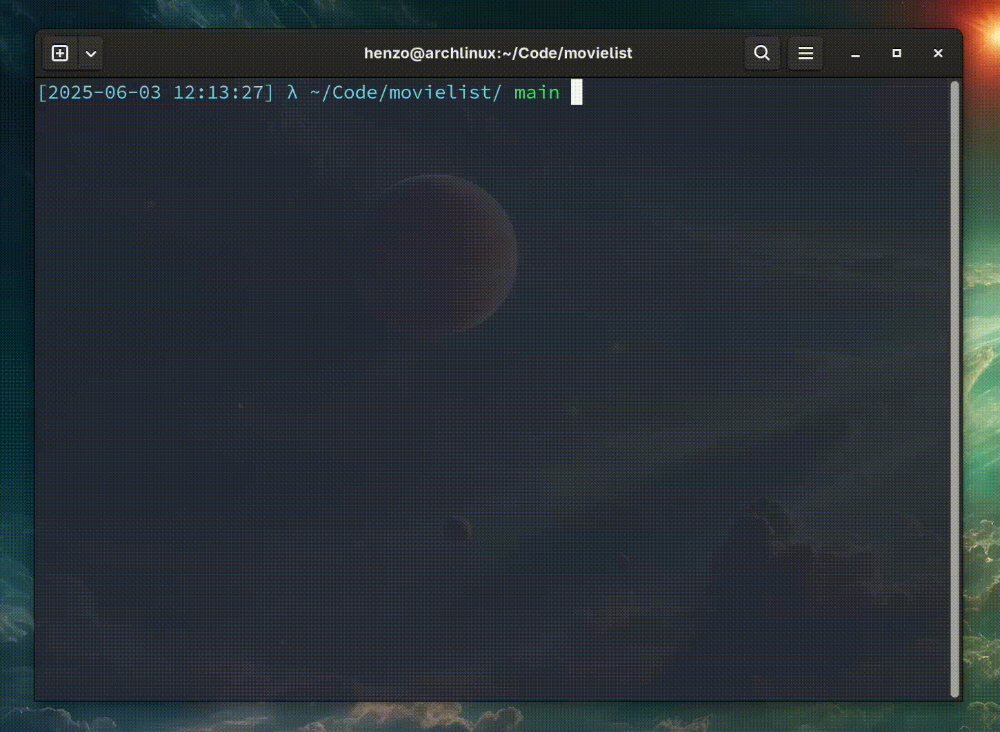

# Golden Raspberry Awards Producer Interval API

A TypeScript REST API that analyzes Golden Raspberry Award data to identify producers with the shortest and longest intervals between consecutive wins.

## What This API Does

The **Golden Raspberry Awards** recognize the "worst" movies of the year. This API analyzes historical winner data to find:

- **Producers with the shortest gap** between consecutive Razzie wins
- **Producers with the longest gap** between consecutive Razzie wins

## Quick Start with Docker

### Prerequisites

- Docker and Docker Compose installed

### Start the API

```bash
# Clone and navigate to project
cd movielist

# Start the API
npm run docker:build

# Verify it's running
curl http://localhost:3000/health
```


### Run Tests

```bash
# Run all tests in Docker
npm run docker:test

# View API logs
npm run docker:logs
```


## API Endpoints

### Main Endpoint

#### `GET /api/producers/prize-intervals`

Returns producers with minimum and maximum intervals between consecutive wins.

**Example Request:**

```bash
curl http://localhost:3000/api/producers/prize-intervals
```

**Example Response:**

```json
{
  "min": [
    {
      "producer": "Joel Silver",
      "interval": 1,
      "previousWin": 1990,
      "followingWin": 1991
    }
  ],
  "max": [
    {
      "producer": "Matthew Vaughn",
      "interval": 13,
      "previousWin": 2002,
      "followingWin": 2015
    }
  ]
}
```

### Health & Debug Endpoints

#### `GET /health`

Health check endpoint for monitoring and load balancers.

```bash
curl http://localhost:3000/health
```

```json
{
  "message": "API is healthy",
  "status": "ready",
  "database": "SQLite in-memory database connected",
  "currentTime": "2025-06-03T15:30:45.123Z"
}
```

#### Debug Endpoints

- `GET /movies` - View all movies in database
- `GET /producers` - View all producers
- `GET /movie-producers` - View movie-producer relationships

### CSV Input Format

The API loads data from semicolon-separated CSV files:

```csv
year;title;studios;producers;winner
1980;Can't Stop the Music;Associated Film Distribution;Allan Carr;yes
1980;Cruising;Lorimar Productions, United Artists;Jerry Weintraub;
1981;Mommie Dearest;Paramount Pictures;Frank Yablans;yes
```

**Column Specifications:**

- **year**: 4-digit year (e.g., 1980)
- **title**: Movie title
- **studios**: Production studios
- **producers**: Producer names (multiple separated by `, ` or `and`)
- **winner**: `yes` for Razzie winner, empty for nominee only

## Architecture

### Technology Stack

- **Node.js + Express** with TypeScript
- **SQLite** in-memory database
- **Docker** containerization
- **Jest** testing framework
- **ESLint** for code quality

### Database Schema

```sql
-- Movies table
CREATE TABLE movies (
  id INTEGER PRIMARY KEY AUTOINCREMENT,
  year INTEGER NOT NULL,
  title TEXT NOT NULL,
  studios TEXT NOT NULL,
  winner BOOLEAN NOT NULL DEFAULT 0
);

-- Producers table
CREATE TABLE producers (
  id INTEGER PRIMARY KEY AUTOINCREMENT,
  name TEXT NOT NULL UNIQUE
)

-- Many-to-many relationship
CREATE TABLE movie_producers (
  id INTEGER PRIMARY KEY AUTOINCREMENT,
  movie_id INTEGER NOT NULL,
  producer_id INTEGER NOT NULL,
  FOREIGN KEY (movie_id) REFERENCES movies (id),
  FOREIGN KEY (producer_id) REFERENCES producers (id)
);
```

### Business Logic

1. **Data Loading**: CSV validation and import with error reporting
2. **Interval Calculation**: Groups producer wins and calculates consecutive gaps
3. **Min/Max Identification**: Finds minimum and maximum intervals
4. **Multiple Results**: Returns all producers tied for min/max intervals

## Development

### Local Development

```bash
# Install dependencies
npm install

# Run in development mode
npm run dev

# Run tests
npm test

# Lint code
npm run lint
```



### Docker Commands

```bash
# Start API
npm run docker:up

# Run tests
npm run docker:test

# Development with hot reload
npm run docker:dev

# Stop containers
npm run docker:down

# View logs
npm run docker:logs
```

### Project Structure

```
src/
├── controllers/         # HTTP request handlers
├── services/            # Business logic
├── db/                  # Database layer
├── routes/              # Express routes
├── middeware/           # Express middleware
├── types/               # TypeScript interfaces
├── schemas/             # Data validation
└── utils/               # Utilities

tests/
├── integration/         # API integration tests
└── utils/               # Test helpers

data/                    # CSV datasets
docker-compose.yml       # Container orchestration
Dockerfile               # Production container
```

## Testing

### Test Datasets

- **`movielist.csv`**: Original Golden Raspberry Awards data
- **`movielist-multiple-wins.csv`**: Dataset with same-year multiple wins
- **`movielist-invalid.csv`**: Invalid data for validation testing

### Test Types

- **Integration Tests**: Full API endpoint testing
- **Data Validation**: CSV format and content validation
- **Error Scenarios**: Invalid data handling
- **Health Checks**: System status validation

### Running Tests

```bash
# All tests
npm test

# Verbose output
npm run test:verbose

# Coverage report
npm run test:coverage

# Integration tests only
npm run test:integration
```

### Successful Response Format

```typescript
interface ProducerIntervalResponse {
  min: ProducerInterval[];
  max: ProducerInterval[];
}

interface ProducerInterval {
  producer: string; // Producer name
  interval: number; // Years between wins
  previousWin: number; // Earlier win year
  followingWin: number; // Later win year
}
```

### Code Quality

- **100% TypeScript** coverage (no `any` types)
- **ESLint** enforcement
- **Comprehensive tests** required
- **Docker** for consistent environments
- **Prettier** for code formatting

### Development Workflow

1. Fork the repository
2. Create feature branch
3. Write tests for new functionality
4. Ensure all tests pass: `npm run docker:test`
5. Lint code: `npm run lint`
6. Submit pull request
