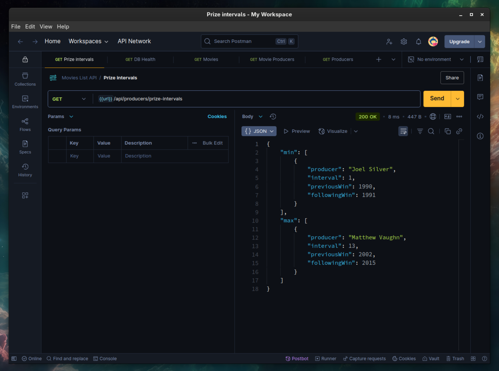

# Golden Raspberry Awards Producer Interval API

**[🇺🇸 English](#english) | [🇧🇷 Português](#português)**

---

## English

A TypeScript REST API that analyzes Golden Raspberry Award data to identify producers with the shortest and longest intervals between consecutive wins.

## What This API Does

The **Golden Raspberry Awards** recognize the "worst" movies of the year. This API analyzes historical winner data to find:

- **Producers with the shortest gap** between consecutive Razzie wins
- **Producers with the longest gap** between consecutive Razzie wins

## Quick Start with Docker

### Prerequisites

- Docker and Docker Compose installed

### Start the API

```bash
# Clone and navigate to project
cd movielist

# Start the API
npm run docker:build

# Verify it's running
curl http://localhost:3000/health
```


### Run Tests

```bash
# Run all tests in Docker
npm run docker:test

# View API logs
npm run docker:logs
```


## API Endpoints

### Main Endpoint

#### `GET /api/producers/prize-intervals`

Returns producers with minimum and maximum intervals between consecutive wins.

**Example Request:**

```bash
curl http://localhost:3000/api/producers/prize-intervals
```

**Example Response:**

```json
{
  "min": [
    {
      "producer": "Joel Silver",
      "interval": 1,
      "previousWin": 1990,
      "followingWin": 1991
    }
  ],
  "max": [
    {
      "producer": "Matthew Vaughn",
      "interval": 13,
      "previousWin": 2002,
      "followingWin": 2015
    }
  ]
}
```

### Health & Debug Endpoints

#### `GET /health`

Health check endpoint for monitoring and load balancers.

```bash
curl http://localhost:3000/health
```

```json
{
  "message": "API is healthy",
  "status": "ready",
  "database": "SQLite in-memory database connected",
  "currentTime": "2025-06-03T15:30:45.123Z"
}
```

#### Debug Endpoints

- `GET /movies` - View all movies in database
- `GET /producers` - View all producers
- `GET /movie-producers` - View movie-producer relationships

### CSV Input Format

The API loads data from semicolon-separated CSV files:

```csv
year;title;studios;producers;winner
1980;Can't Stop the Music;Associated Film Distribution;Allan Carr;yes
1980;Cruising;Lorimar Productions, United Artists;Jerry Weintraub;
1981;Mommie Dearest;Paramount Pictures;Frank Yablans;yes
```

**Column Specifications:**

- **year**: 4-digit year (e.g., 1980)
- **title**: Movie title
- **studios**: Production studios
- **producers**: Producer names (multiple separated by `, ` or `and`)
- **winner**: `yes` for Razzie winner, empty for nominee only

## Architecture

### Technology Stack

- **Node.js + Express** with TypeScript
- **SQLite** in-memory database
- **Docker** containerization
- **Jest** testing framework
- **ESLint** for code quality

### Database Schema

```sql
-- Movies table
CREATE TABLE movies (
  id INTEGER PRIMARY KEY AUTOINCREMENT,
  year INTEGER NOT NULL,
  title TEXT NOT NULL,
  studios TEXT NOT NULL,
  winner BOOLEAN NOT NULL DEFAULT 0
);

-- Producers table
CREATE TABLE producers (
  id INTEGER PRIMARY KEY AUTOINCREMENT,
  name TEXT NOT NULL UNIQUE
)

-- Many-to-many relationship
CREATE TABLE movie_producers (
  id INTEGER PRIMARY KEY AUTOINCREMENT,
  movie_id INTEGER NOT NULL,
  producer_id INTEGER NOT NULL,
  FOREIGN KEY (movie_id) REFERENCES movies (id),
  FOREIGN KEY (producer_id) REFERENCES producers (id)
);
```

### Business Logic

1. **Data Loading**: CSV validation and import with error reporting
2. **Interval Calculation**: Groups producer wins and calculates consecutive gaps
3. **Min/Max Identification**: Finds minimum and maximum intervals
4. **Multiple Results**: Returns all producers tied for min/max intervals

## Development

### Local Development

```bash
# Install dependencies
npm install

# Run in development mode
npm run dev

# Run tests
npm test

# Lint code
npm run lint
```


### Docker Commands

```bash
# Start API
npm run docker:up

# Run tests
npm run docker:test

# Development with hot reload
npm run docker:dev

# Stop containers
npm run docker:down

# View logs
npm run docker:logs
```

### Project Structure

```
src/
├── controllers/         # HTTP request handlers
├── services/            # Business logic
├── db/                  # Database layer
├── routes/              # Express routes
├── middeware/           # Express middleware
├── types/               # TypeScript interfaces
├── schemas/             # Data validation
└── utils/               # Utilities

tests/
├── integration/         # API integration tests
└── utils/               # Test helpers

_collection/             # Postman API collection
data/                    # CSV datasets
docker-compose.yml       # Container orchestration
Dockerfile               # Production container
```

## Testing

### Test Datasets

- **`movielist.csv`**: Original Golden Raspberry Awards data
- **`movielist-multiple-wins.csv`**: Dataset with same-year multiple wins
- **`movielist-invalid.csv`**: Invalid data for validation testing

### Test Types

- **Integration Tests**: Full API endpoint testing
- **Data Validation**: CSV format and content validation
- **Error Scenarios**: Invalid data handling
- **Health Checks**: System status validation

### Running Tests

```bash
# All tests
npm test

# Verbose output
npm run test:verbose

# Coverage report
npm run test:coverage

# Integration tests only
npm run test:integration
```

### Successful Response Format

```typescript
interface ProducerIntervalResponse {
  min: ProducerInterval[];
  max: ProducerInterval[];
}

interface ProducerInterval {
  producer: string; // Producer name
  interval: number; // Years between wins
  previousWin: number; // Earlier win year
  followingWin: number; // Later win year
}
```

### Code Quality

- **100% TypeScript** coverage (no `any` types)
- **ESLint** enforcement
- **Comprehensive tests** required
- **Docker** for consistent environments
- **Prettier** for code formatting

### Development Workflow

1. Fork the repository
2. Create feature branch
3. Write tests for new functionality
4. Ensure all tests pass: `npm run docker:test`
5. Lint code: `npm run lint`
6. Submit pull request

## Postman Collection

A complete Postman collection is available for testing all API endpoints:

### Import Collection

1. **Download**: Collection file located at `_collection` folder
2. **Import**: Open Postman → Import → Select the collection file
3. **Environment**: Base url is already configured in the {{url}} variable

### Available Requests

The collection includes pre-configured requests for:

- **Main API**: `GET /api/producers/prize-intervals`
- **Health Check**: `GET /health` with response validation
- **Debug Endpoints**: All helper endpoints for data exploration



---

## Português

Uma API REST em TypeScript que analisa dados do Golden Raspberry Award para identificar produtores com os menores e maiores intervalos entre vitórias consecutivas.

## O Que Esta API Faz

O **Golden Raspberry Awards** reconhece os "piores" filmes do ano. Esta API analisa dados históricos de vencedores para encontrar:

- **Produtores com o menor intervalo** entre vitórias consecutivas do Razzie
- **Produtores com o maior intervalo** entre vitórias consecutivas do Razzie

## Início Rápido com Docker

### Pré-requisitos

- Docker e Docker Compose instalados

### Iniciar a API

```bash
# Clone e navegue para o projeto
cd movielist

# Inicie a API
npm run docker:build

# Verifique se está funcionando
curl http://localhost:3000/health
```


### Executar Testes

```bash
# Execute todos os testes no Docker
npm run docker:test

# Visualize logs da API
npm run docker:logs
```


## Endpoints da API

### Endpoint Principal

#### `GET /api/producers/prize-intervals`

Retorna produtores com intervalos mínimos e máximos entre vitórias consecutivas.

**Exemplo de Requisição:**

```bash
curl http://localhost:3000/api/producers/prize-intervals
```

**Exemplo de Resposta:**

```json
{
  "min": [
    {
      "producer": "Joel Silver",
      "interval": 1,
      "previousWin": 1990,
      "followingWin": 1991
    }
  ],
  "max": [
    {
      "producer": "Matthew Vaughn",
      "interval": 13,
      "previousWin": 2002,
      "followingWin": 2015
    }
  ]
}
```

### Endpoints de Saúde e Debug

#### `GET /health`

Endpoint de verificação de saúde para monitoramento e load balancers.

```bash
curl http://localhost:3000/health
```

```json
{
  "message": "API is healthy",
  "status": "ready",
  "database": "SQLite in-memory database connected",
  "currentTime": "2025-06-03T15:30:45.123Z"
}
```

#### Endpoints de Debug

- `GET /movies` - Visualizar todos os filmes no banco de dados
- `GET /producers` - Visualizar todos os produtores
- `GET /movie-producers` - Visualizar relacionamentos filme-produtor

### Formato de Entrada CSV

A API carrega dados de arquivos CSV separados por ponto e vírgula:

```csv
year;title;studios;producers;winner
1980;Can't Stop the Music;Associated Film Distribution;Allan Carr;yes
1980;Cruising;Lorimar Productions, United Artists;Jerry Weintraub;
1981;Mommie Dearest;Paramount Pictures;Frank Yablans;yes
```

**Especificações das Colunas:**

- **year**: Ano com 4 dígitos (ex: 1980)
- **title**: Título do filme
- **studios**: Estúdios de produção
- **producers**: Nomes dos produtores (múltiplos separados por `, ` ou `and`)
- **winner**: `yes` para vencedor do Razzie, vazio para apenas indicado

## Arquitetura

### Stack Tecnológico

- **Node.js + Express** com TypeScript
- **SQLite** banco de dados em memória
- **Docker** containerização
- **Jest** framework de testes
- **ESLint** para qualidade de código

### Schema do Banco de Dados

```sql
-- Tabela de filmes
CREATE TABLE movies (
  id INTEGER PRIMARY KEY AUTOINCREMENT,
  year INTEGER NOT NULL,
  title TEXT NOT NULL,
  studios TEXT NOT NULL,
  winner BOOLEAN NOT NULL DEFAULT 0
);

-- Tabela de produtores
CREATE TABLE producers (
  id INTEGER PRIMARY KEY AUTOINCREMENT,
  name TEXT NOT NULL UNIQUE
)

-- Relacionamento muitos-para-muitos
CREATE TABLE movie_producers (
  id INTEGER PRIMARY KEY AUTOINCREMENT,
  movie_id INTEGER NOT NULL,
  producer_id INTEGER NOT NULL,
  FOREIGN KEY (movie_id) REFERENCES movies (id),
  FOREIGN KEY (producer_id) REFERENCES producers (id)
);
```

### Lógica de Negócio

1. **Carregamento de Dados**: Validação e importação de CSV com relatório de erros
2. **Cálculo de Intervalos**: Agrupa vitórias de produtores e calcula intervalos consecutivos
3. **Identificação Min/Max**: Encontra intervalos mínimos e máximos
4. **Múltiplos Resultados**: Retorna todos os produtores empatados em intervalos min/max

## Desenvolvimento

### Desenvolvimento Local

```bash
# Instalar dependências
npm install

# Executar em modo de desenvolvimento
npm run dev

# Executar testes
npm test

# Analisar código
npm run lint
```


### Comandos Docker

```bash
# Iniciar API
npm run docker:up

# Executar testes
npm run docker:test

# Desenvolvimento com hot reload
npm run docker:dev

# Parar containers
npm run docker:down

# Visualizar logs
npm run docker:logs
```

### Estrutura do Projeto

```
src/
├── controllers/         # Manipuladores de requisições HTTP
├── services/            # Lógica de negócio
├── db/                  # Camada de banco de dados
├── routes/              # Rotas do Express
├── middleware/          # Middleware do Express
├── types/               # Interfaces TypeScript
├── schemas/             # Validação de dados
└── utils/               # Utilitários

tests/
├── integration/         # Testes de integração da API
└── utils/               # Utilitários de teste

_collection/             # Coleção da API do Postman
data/                    # Datasets CSV
docker-compose.yml       # Orquestração de containers
Dockerfile               # Container de produção
```

## Testes

### Datasets de Teste

- **`movielist.csv`**: Dados originais do Golden Raspberry Awards
- **`movielist-multiple-wins.csv`**: Dataset com múltiplas vitórias no mesmo ano
- **`movielist-invalid.csv`**: Dados inválidos para teste de validação

### Tipos de Teste

- **Testes de Integração**: Teste completo dos endpoints da API
- **Validação de Dados**: Validação de formato e conteúdo CSV
- **Cenários de Erro**: Tratamento de dados inválidos
- **Verificações de Saúde**: Validação do status do sistema

### Executando Testes

```bash
# Todos os testes
npm test

# Saída detalhada
npm run test:verbose

# Relatório de cobertura
npm run test:coverage

# Apenas testes de integração
npm run test:integration
```

### Formato de Resposta de Sucesso

```typescript
interface ProducerIntervalResponse {
  min: ProducerInterval[];
  max: ProducerInterval[];
}

interface ProducerInterval {
  producer: string; // Nome do produtor
  interval: number; // Anos entre vitórias
  previousWin: number; // Ano da vitória anterior
  followingWin: number; // Ano da vitória seguinte
}
```

### Qualidade de Código

- **100% TypeScript** cobertura (sem tipos `any`)
- **ESLint** enforcement
- **Testes abrangentes** obrigatórios
- **Docker** para ambientes consistentes
- **Prettier** para formatação de código

### Fluxo de Desenvolvimento

1. Faça fork do repositório
2. Crie branch de feature
3. Escreva testes para nova funcionalidade
4. Garanta que todos os testes passem: `npm run docker:test`
5. Analise código: `npm run lint`
6. Submeta pull request

## Coleção do Postman

Uma coleção completa do Postman está disponível para testar todos os endpoints da API:

### Importar Coleção

1. **Download**: Arquivo da coleção localizado na pasta `_collection`
2. **Importar**: Abrir Postman → Import → Selecionar o arquivo da coleção
3. **Ambiente**: URL base já configurada na variável {{url}}

### Requisições Disponíveis

A coleção inclui requisições pré-configuradas para:

- **API Principal**: `GET /api/producers/prize-intervals`
- **Verificação de Saúde**: `GET /health` com validação de resposta
- **Endpoints de Debug**: Todos os endpoints auxiliares para exploração de dados


